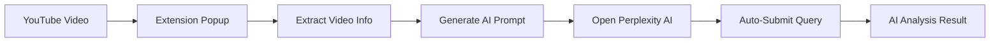

# 🎥 YouTube to Perplexity AI


<div align="center">

[](https://chrome.google.com/webstore)
[](https://github.com/kuldeep27396/youtube-to-perplexity-ai/releases)
[](LICENSE)
[](CONTRIBUTING.md)
[](https://github.com/kuldeep27396/youtube-to-perplexity-ai/stargazers)

**Instantly analyze YouTube videos with Perplexity AI. Get smart summaries, key insights, and actionable takeaways in seconds.**

[🚀 Install Extension](https://chrome.google.com/webstore) • [📖 Documentation](docs/) • [🐛 Report Bug](https://github.com/kuldeep27396/youtube-to-perplexity-ai/issues) • [💡 Request Feature](https://github.com/kuldeep27396/youtube-to-perplexity-ai/issues/new?template=feature_request.md)

</div>

---

## ✨ Features

- **🎯 One-Click Analysis** - Instantly send YouTube videos to Perplexity AI
- **🤖 Smart Prompts** - Optimized prompts for structured, comprehensive summaries
- **⚡ Auto-Submission** - Automatically fills and submits the query to Perplexity
- **🔒 Privacy-First** - No data collection, no tracking, no personal information stored
- **🎨 Professional Design** - Clean, intuitive interface with custom branding
- **📱 Lightweight** - Minimal resource usage, fast performance

## 🚀 Quick Start

### Installation

#### From Chrome Web Store (Recommended)
1. Visit the [Chrome Web Store page](https://chrome.google.com/webstore)
2. Click "Add to Chrome"
3. Confirm installation
4. Start analyzing YouTube videos!

#### From Source
1. Download or clone this repository
2. Open Chrome → Extensions → Developer Mode
3. Click "Load unpacked" → Select project folder
4. Generate icons using `create_icons.html`
5. Test on any YouTube video

### Usage

1. **Navigate** to any YouTube video
2. **Click** the extension icon in your browser toolbar
3. **Analyze** - The video URL is automatically sent to Perplexity AI with an optimized prompt
4. **Review** - Get a structured summary with key points and detailed analysis

## 🎬 Demo

<!-- Add GIF/video demo here -->
*Demo video coming soon! See [assets/screenshots](assets/screenshots) for current screenshots.*

## 🏗️ Architecture



## 📁 Project Structure

```
youtube-to-perplexity-ai/
├── 📁 src/
│   ├── 📁 popup/           # Extension popup interface
│   │   ├── popup.html      # Popup UI
│   │   └── popup.js        # Popup logic
│   ├── 📁 content/         # Content scripts
│   │   ├── content.js      # YouTube page script
│   │   └── perplexity-content.js # Perplexity auto-submit
│   ├── 📁 background/      # Background scripts
│   │   └── background.js   # Service worker
│   └── 📁 assets/          # Static assets
├── 📁 assets/              # Documentation assets
│   ├── 📁 icons/           # Extension icons
│   └── 📁 screenshots/     # Demo screenshots
├── 📁 docs/                # Documentation
├── 📁 scripts/             # Build and utility scripts
├── manifest.json           # Extension configuration
├── README.md              # This file
└── LICENSE                # MIT License
```

## 🛠️ Development

### Prerequisites
- Google Chrome or Chromium browser
- Basic knowledge of JavaScript and Chrome Extensions

### Setup Development Environment

1. **Clone the repository**
   ```bash
   git clone https://github.com/kuldeep27396/youtube-to-perplexity-ai.git
   cd youtube-to-perplexity-ai
   ```

2. **Load extension in Chrome**
   - Open `chrome://extensions/`
   - Enable "Developer mode"
   - Click "Load unpacked"
   - Select the project directory

3. **Generate icons** (if needed)
   - Open `create_icons.html` in your browser
   - Upload your logo and download the generated icons

4. **Test the extension**
   - Navigate to any YouTube video
   - Click the extension icon
   - Verify it opens Perplexity with the correct prompt

### Making Changes

1. Edit the source files in the `src/` directory
2. Reload the extension in `chrome://extensions/`
3. Test your changes
4. Submit a pull request

## 🤝 Contributing

We welcome contributions! Please see our [Contributing Guidelines](CONTRIBUTING.md) for details.

### Quick Contribution Guide

1. Fork the repository
2. Create a feature branch (`git checkout -b feature/amazing-feature`)
3. Commit your changes (`git commit -m 'Add amazing feature'`)
4. Push to the branch (`git push origin feature/amazing-feature`)
5. Open a Pull Request

### Areas for Contribution

- 🎨 UI/UX improvements
- 🤖 Additional AI provider integrations
- 🔧 Performance optimizations
- 📝 Documentation enhancements
- 🧪 Testing and quality assurance
- 🌐 Internationalization (i18n)

## 🔒 Privacy & Security

This extension prioritizes your privacy:

- ✅ **No data collection** - We don't store or track anything
- ✅ **No personal information** - Only video URLs are processed
- ✅ **No account required** - Works immediately
- ✅ **Open source** - Transparent code, no hidden functionality
- ✅ **Minimal permissions** - Only requests necessary access

For detailed privacy information, see our [Privacy Policy](privacy-policy.md).

## 📈 Roadmap

### Version 1.2.0
- [ ] Multiple AI providers (ChatGPT, Claude, Gemini)
- [ ] Custom prompt templates
- [ ] Summary history and bookmarks

### Version 1.3.0
- [ ] Export options (PDF, Markdown)
- [ ] Batch processing for playlists
- [ ] Timestamp extraction

### Version 2.0.0
- [ ] Browser extension for Firefox and Edge
- [ ] Mobile app companion
- [ ] Team collaboration features

See our [full roadmap](https://github.com/kuldeep27396/youtube-to-perplexity-ai/projects) for more details.

## 💬 Community

- 💬 [Discussions](https://github.com/kuldeep27396/youtube-to-perplexity-ai/discussions) - Ask questions and share ideas
- 🐛 [Issues](https://github.com/kuldeep27396/youtube-to-perplexity-ai/issues) - Report bugs and request features
- 📧 [Email](mailto:kuldeep27396@gmail.com) - Direct contact for urgent matters

## 📊 Stats

- 🎯 **Purpose**: Single-click YouTube video analysis
- ⚡ **Performance**: < 100ms response time
- 🔒 **Privacy**: Zero data collection
- 📱 **Size**: < 50KB total extension size
- 🌍 **Compatibility**: Chrome, Edge, Brave (Manifest V3)

## 📄 License

This project is licensed under the MIT License - see the [LICENSE](LICENSE) file for details.

## 🙏 Acknowledgments

- 🎨 **Perplexity AI** for providing excellent AI analysis
- 🎥 **YouTube** for the video platform
- 🌟 **Contributors** who help improve this extension
- 💡 **Users** who provide valuable feedback

## ⭐ Show Your Support

If this extension helps you save time and gain insights from YouTube videos, please:

- ⭐ Star this repository
- 🐛 Report any bugs you find
- 💡 Suggest new features
- 📢 Share with friends and colleagues
- ✍️ Write a review on the Chrome Web Store

---

<div align="center">

**Made with ❤️ by [Kuldeep](https://github.com/kuldeep27396)**

[🌟 Star this repo](https://github.com/kuldeep27396/youtube-to-perplexity-ai/stargazers) • [🔄 Fork this repo](https://github.com/kuldeep27396/youtube-to-perplexity-ai/fork) • [📋 Copy link](https://github.com/kuldeep27396/youtube-to-perplexity-ai)

</div>
